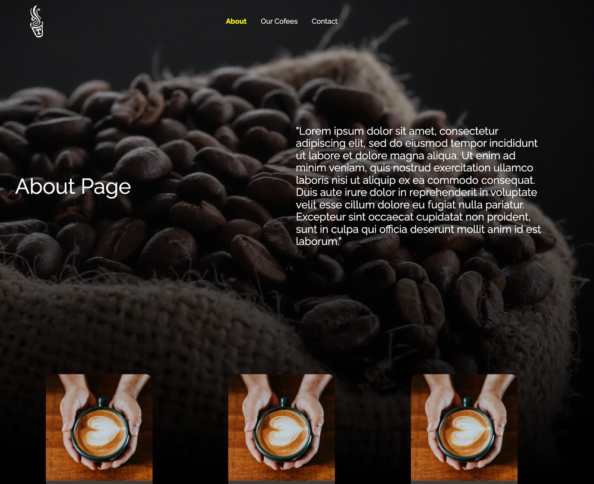

Trabajo realizado en clase (Bootcamp SoyHenry feb-2022) para experimentar las diversas opciones de trabajar con CSS en React: Css Modules y Styled Components.

# Landing Page Demo

Landing page sencilla desarrollada con React.js, React-Router-Dom v:6.3, Styled components y css.modules. La página tiene un componente principal "Layout" que contiene a la barra de navegación superior, una imagen de background y un footer con tres componentes Card.

Ver aplicación deployada en: https://landingpage-fuhrn.vercel.app/

